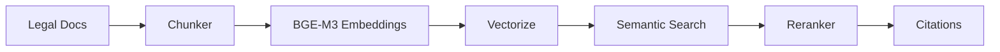

# Phase 03: RAG Pipeline (Vietnamese Embeddings + Vectorize)

## Context Links
- [Parent Plan](plan.md)
- [Research: Cloudflare RAG](research/researcher-01-cloudflare-vietnamese-rag.md)
- [Prev: Project Setup](phase-01-project-setup.md)
- [Next: AI Integration](phase-04-ai-integration.md)

## Overview
- **Date**: 2025-11-15
- **Description**: Implement Vietnamese legal document RAG pipeline with Vectorize
- **Priority**: P0 - Core AI functionality
- **Implementation Status**: 🔴 Not Started
- **Review Status**: 🔴 Not Started

## Key Insights
- BGE-M3 best for Vietnamese embeddings (100+ languages)
- 512 token chunks optimal for legal clauses
- 20% overlap for narrative legal texts
- Vectorize supports 5M vectors per index
- Implement citation tracking for compliance

## Requirements

### Functional
- Ingest Vietnamese legal documents
- Generate embeddings with BGE-M3
- Store vectors in Vectorize
- Implement semantic search
- Track citations & confidence scores

### Non-functional
- <50ms p99 query latency
- Support 1M+ legal documents
- 0.75+ confidence threshold
- Maintain law hierarchy validation

## Architecture



## Related Code Files

### Create
- `/packages/ai/rag/chunker.ts` - Document chunking
- `/packages/ai/rag/embeddings.ts` - Embedding generation
- `/packages/ai/rag/vectorstore.ts` - Vectorize operations
- `/packages/ai/rag/search.ts` - Semantic search
- `/packages/ai/rag/reranker.ts` - Result reranking

## Implementation Steps

1. **Setup Vectorize Index**
```typescript
// packages/ai/rag/vectorstore.ts
export async function createIndex(env: Env) {
  const index = env.VECTORIZE_INDEX;

  // Configure with BGE-M3 dimensions
  const config = {
    dimensions: 1024,
    metric: 'cosine',
    preset: '@cf/baai/bge-m3'
  };

  return index;
}
```

2. **Implement Document Chunker**
```typescript
// packages/ai/rag/chunker.ts
export class LegalDocumentChunker {
  private readonly config = {
    chunkSize: 512,
    chunkOverlap: 100,
    vietnameseMultiplier: 1.5
  };

  async chunk(document: string): Promise<Chunk[]> {
    const chunks: Chunk[] = [];
    const sentences = this.splitVietnamese(document);

    let currentChunk = '';
    let tokenCount = 0;

    for (const sentence of sentences) {
      const sentenceTokens = this.countTokens(sentence);

      if (tokenCount + sentenceTokens > this.config.chunkSize) {
        chunks.push({
          text: currentChunk,
          tokens: tokenCount,
          metadata: this.extractMetadata(currentChunk)
        });

        // Overlap
        const overlap = currentChunk.slice(-this.config.chunkOverlap);
        currentChunk = overlap + sentence;
        tokenCount = this.countTokens(currentChunk);
      } else {
        currentChunk += ' ' + sentence;
        tokenCount += sentenceTokens;
      }
    }

    return chunks;
  }

  private extractMetadata(chunk: string): ChunkMetadata {
    return {
      law_code: this.extractLawCode(chunk),
      article: this.extractArticle(chunk),
      date: this.extractDate(chunk),
      category: this.detectCategory(chunk)
    };
  }
}
```

3. **Generate Embeddings**
```typescript
// packages/ai/rag/embeddings.ts
export class EmbeddingGenerator {
  constructor(private ai: Ai) {}

  async generateEmbeddings(chunks: Chunk[]): Promise<Vector[]> {
    const vectors: Vector[] = [];

    // Batch process for efficiency
    const batchSize = 100;
    for (let i = 0; i < chunks.length; i += batchSize) {
      const batch = chunks.slice(i, i + batchSize);

      const embeddings = await this.ai.run(
        '@cf/baai/bge-m3',
        {
          text: batch.map(c => c.text)
        }
      );

      batch.forEach((chunk, idx) => {
        vectors.push({
          id: crypto.randomUUID(),
          values: embeddings.data[idx],
          metadata: {
            text: chunk.text,
            ...chunk.metadata
          }
        });
      });
    }

    return vectors;
  }
}
```

4. **Store in Vectorize**
```typescript
// packages/ai/rag/vectorstore.ts
export class VectorStore {
  constructor(private index: VectorizeIndex) {}

  async upsert(vectors: Vector[]): Promise<void> {
    // Vectorize batch limit: 200K vectors
    const batchSize = 100000;

    for (let i = 0; i < vectors.length; i += batchSize) {
      const batch = vectors.slice(i, i + batchSize);
      await this.index.upsert(batch);
    }
  }

  async createNamespaces() {
    // Organize by legal category
    const namespaces = ['civil', 'criminal', 'labor', 'commercial'];
    for (const ns of namespaces) {
      await this.index.createNamespace(ns);
    }
  }
}
```

5. **Implement Semantic Search**
```typescript
// packages/ai/rag/search.ts
export class SemanticSearch {
  constructor(
    private vectorStore: VectorStore,
    private embeddings: EmbeddingGenerator
  ) {}

  async search(query: string, options: SearchOptions = {}): Promise<SearchResult[]> {
    const {
      topK = 5,
      minConfidence = 0.75,
      namespace = null,
      filter = {}
    } = options;

    // Generate query embedding
    const queryEmbedding = await this.embeddings.generateEmbeddings([
      { text: query, metadata: {} }
    ]);

    // Search Vectorize
    const results = await this.vectorStore.index.query(
      queryEmbedding[0].values,
      {
        topK,
        namespace,
        filter,
        includeMetadata: true,
        includeValues: false
      }
    );

    // Filter by confidence
    return results.matches
      .filter(m => m.score >= minConfidence)
      .map(m => ({
        id: m.id,
        text: m.metadata.text,
        score: m.score,
        metadata: m.metadata
      }));
  }
}
```

6. **Implement Reranker**
```typescript
// packages/ai/rag/reranker.ts
export class Reranker {
  async rerank(
    query: string,
    results: SearchResult[]
  ): Promise<SearchResult[]> {
    // Cross-encoder reranking for better relevance
    const rerankedScores = await this.crossEncode(query, results);

    return results
      .map((r, i) => ({
        ...r,
        score: (r.score + rerankedScores[i]) / 2
      }))
      .sort((a, b) => b.score - a.score);
  }

  private validateLawHierarchy(results: SearchResult[]): SearchResult[] {
    // Constitution > Laws > Decrees > Circulars
    const hierarchy = {
      'constitution': 4,
      'law': 3,
      'decree': 2,
      'circular': 1
    };

    return results.sort((a, b) => {
      const aLevel = hierarchy[a.metadata.type] || 0;
      const bLevel = hierarchy[b.metadata.type] || 0;
      return bLevel - aLevel;
    });
  }
}
```

7. **Citation Tracking**
```typescript
// packages/ai/rag/citations.ts
export interface Citation {
  law: string;
  article: string;
  confidence: number;
  url?: string;
}

export class CitationTracker {
  formatResponse(answer: string, sources: SearchResult[]): RagResponse {
    return {
      answer,
      sources: sources.map(s => ({
        law: s.metadata.law_code,
        article: s.metadata.article,
        confidence: s.score,
        url: this.generateLawUrl(s.metadata)
      })),
      disclaimer: 'Đây là thông tin pháp lý do AI tạo. Vui lòng tham khảo chuyên gia pháp lý.'
    };
  }
}
```

## Todo List
- [ ] Create Vectorize index with BGE-M3
- [ ] Implement document chunker
- [ ] Setup embedding generation
- [ ] Create vector store operations
- [ ] Implement semantic search
- [ ] Build reranker
- [ ] Add citation tracking
- [ ] Setup law hierarchy validation
- [ ] Create ingestion pipeline
- [ ] Test with Vietnamese legal docs
- [ ] Benchmark search performance

## Success Criteria
- Embeddings generated for 100K+ documents
- Search latency <50ms p99
- Confidence scores >0.75 for relevant results
- Citations properly tracked
- Vietnamese text handled correctly

## Risk Assessment
- **Risk**: Vietnamese tokenization accuracy
- **Mitigation**: Test with legal corpus, adjust multiplier
- **Risk**: Vector index size limit (5M)
- **Mitigation**: Implement sharding strategy

## Security Considerations
- Validate document sources
- Sanitize search queries
- Rate limit embedding generation
- Audit access to legal documents

## Next Steps
- Phase 04: AI Integration (uses RAG)
- Phase 05: API Layer (can run parallel)