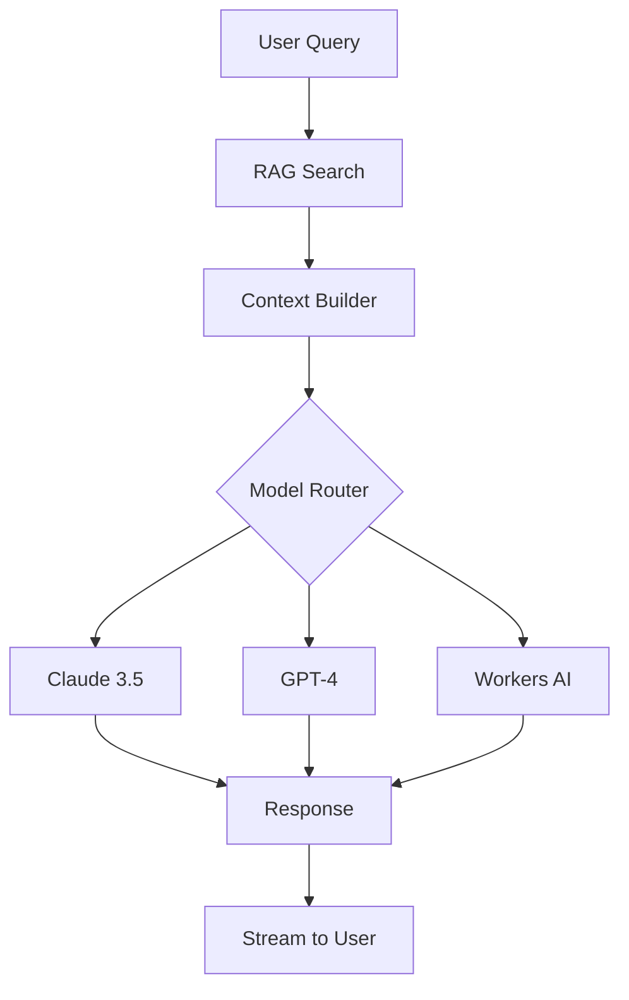

# Phase 04: AI Integration (Workers AI + External LLM Hybrid)

## Context Links
- [Parent Plan](plan.md)
- [Research: Cloudflare RAG](research/researcher-01-cloudflare-vietnamese-rag.md)
- [Prev: RAG Pipeline](phase-03-rag-pipeline.md)
- [Next: API Layer](phase-05-api-layer.md)

## Overview
- **Date**: 2025-11-15
- **Description**: Hybrid AI system using Workers AI for embeddings, external LLMs for generation
- **Priority**: P1 - Core chatbot intelligence
- **Implementation Status**: 🔴 Not Started
- **Review Status**: 🔴 Not Started

## Key Insights
- Workers AI: $11/1M tokens (embeddings)
- Claude 3.5: $3/1M tokens (generation)
- SEA-LION model for Vietnamese legal
- Hybrid approach most cost-effective
- Implement fallback mechanisms

## Requirements

### Functional
- Multi-model support (Claude, GPT, Gemini)
- Vietnamese language processing
- Legal context understanding
- Streaming responses
- Conversation memory management

### Non-functional
- <2s response time
- 99.9% availability
- Graceful degradation
- Token usage optimization

## Architecture



## Related Code Files

### Create
- `/packages/ai/llm/router.ts` - Model routing logic
- `/packages/ai/llm/claude.ts` - Claude integration
- `/packages/ai/llm/openai.ts` - OpenAI integration
- `/packages/ai/llm/workers.ts` - Workers AI integration
- `/packages/ai/context/builder.ts` - Context construction
- `/packages/ai/memory/manager.ts` - Conversation memory

## Implementation Steps

1. **Model Router Implementation**
```typescript
// packages/ai/llm/router.ts
export class ModelRouter {
  private models = {
    claude: new ClaudeModel(),
    openai: new OpenAIModel(),
    workers: new WorkersAIModel()
  };

  async route(request: ChatRequest): Promise<ModelSelection> {
    // Decision logic
    if (request.requiresHighAccuracy) {
      return this.models.claude;
    }
    if (request.isSimpleQuery) {
      return this.models.workers;
    }
    return this.models.openai;
  }

  async routeWithFallback(request: ChatRequest): Promise<Response> {
    const primary = await this.route(request);

    try {
      return await primary.generate(request);
    } catch (error) {
      // Fallback logic
      const fallback = this.getFallbackModel(primary);
      return await fallback.generate(request);
    }
  }
}
```

2. **Claude Integration**
```typescript
// packages/ai/llm/claude.ts
export class ClaudeModel {
  private readonly config = {
    model: 'claude-3-5-sonnet-20241022',
    maxTokens: 4096,
    temperature: 0.3,
    apiKey: env.CLAUDE_API_KEY
  };

  async generate(request: ChatRequest): Promise<StreamResponse> {
    const messages = this.buildMessages(request);

    const response = await fetch('https://api.anthropic.com/v1/messages', {
      method: 'POST',
      headers: {
        'Content-Type': 'application/json',
        'X-API-Key': this.config.apiKey,
        'anthropic-version': '2023-06-01'
      },
      body: JSON.stringify({
        model: this.config.model,
        messages,
        max_tokens: this.config.maxTokens,
        temperature: this.config.temperature,
        stream: true
      })
    });

    return this.streamResponse(response);
  }

  private buildMessages(request: ChatRequest): Message[] {
    return [
      {
        role: 'system',
        content: this.getSystemPrompt()
      },
      {
        role: 'user',
        content: this.buildUserMessage(request)
      }
    ];
  }

  private getSystemPrompt(): string {
    return `You are a Vietnamese legal assistant. Provide accurate legal information based on Vietnamese law.
    Always cite specific laws and articles. Include disclaimers about seeking professional legal advice.
    Respond in Vietnamese unless asked otherwise.`;
  }
}
```

3. **Workers AI Integration**
```typescript
// packages/ai/llm/workers.ts
export class WorkersAIModel {
  constructor(private ai: Ai) {}

  async generate(request: ChatRequest): Promise<Response> {
    // Use SEA-LION for Vietnamese
    const model = '@cf/aisingapore/gemma-sea-lion-v4-27b-it';

    const response = await this.ai.run(model, {
      messages: request.messages,
      stream: true
    });

    return new Response(response, {
      headers: {
        'Content-Type': 'text/event-stream'
      }
    });
  }

  async generateEmbeddings(text: string): Promise<number[]> {
    const response = await this.ai.run('@cf/baai/bge-m3', {
      text: [text]
    });

    return response.data[0];
  }
}
```

4. **Context Builder**
```typescript
// packages/ai/context/builder.ts
export class ContextBuilder {
  constructor(
    private ragSearch: SemanticSearch,
    private memory: ConversationMemory
  ) {}

  async buildContext(query: string, conversationId: string): Promise<Context> {
    // Get relevant documents
    const documents = await this.ragSearch.search(query, {
      topK: 5,
      minConfidence: 0.75
    });

    // Get conversation history
    const history = await this.memory.getHistory(conversationId, 10);

    // Build context
    return {
      query,
      documents: documents.map(d => ({
        content: d.text,
        source: d.metadata,
        confidence: d.score
      })),
      history: history.slice(-5), // Last 5 messages
      metadata: {
        conversationId,
        timestamp: Date.now()
      }
    };
  }

  formatForLLM(context: Context): string {
    let formatted = 'RELEVANT LEGAL DOCUMENTS:\n';

    for (const doc of context.documents) {
      formatted += `\n[${doc.source.law_code} - Article ${doc.source.article}]\n`;
      formatted += `${doc.content}\n`;
      formatted += `Confidence: ${(doc.confidence * 100).toFixed(1)}%\n`;
    }

    formatted += '\n\nCONVERSATION HISTORY:\n';
    for (const msg of context.history) {
      formatted += `${msg.role}: ${msg.content}\n`;
    }

    formatted += '\n\nUSER QUERY:\n' + context.query;

    return formatted;
  }
}
```

5. **Conversation Memory Manager**
```typescript
// packages/ai/memory/manager.ts
export class ConversationMemory {
  constructor(
    private db: D1Database,
    private kv: KVNamespace
  ) {}

  async saveMessage(
    conversationId: string,
    message: Message
  ): Promise<void> {
    // Save to D1
    await this.db.prepare(`
      INSERT INTO messages (conversation_id, role, content, created_at)
      VALUES (?, ?, ?, ?)
    `).bind(
      conversationId,
      message.role,
      message.content,
      new Date().toISOString()
    ).run();

    // Update KV cache
    const cacheKey = `conv:${conversationId}`;
    const cached = await this.kv.get(cacheKey, 'json') || [];
    cached.push(message);

    // Keep last 20 messages in cache
    if (cached.length > 20) {
      cached.shift();
    }

    await this.kv.put(cacheKey, JSON.stringify(cached), {
      expirationTtl: 3600 // 1 hour
    });
  }

  async getHistory(
    conversationId: string,
    limit: number = 10
  ): Promise<Message[]> {
    // Try cache first
    const cached = await this.kv.get(`conv:${conversationId}`, 'json');
    if (cached) {
      return cached.slice(-limit);
    }

    // Fallback to D1
    const result = await this.db.prepare(`
      SELECT role, content, created_at
      FROM messages
      WHERE conversation_id = ?
      ORDER BY created_at DESC
      LIMIT ?
    `).bind(conversationId, limit).all();

    return result.results.reverse();
  }
}
```

6. **Streaming Response Handler**
```typescript
// packages/ai/stream/handler.ts
export class StreamHandler {
  async streamToClient(
    stream: ReadableStream,
    writer: WritableStreamDefaultWriter
  ): Promise<void> {
    const reader = stream.getReader();
    const decoder = new TextDecoder();

    try {
      while (true) {
        const { done, value } = await reader.read();
        if (done) break;

        const chunk = decoder.decode(value);
        const parsed = this.parseSSE(chunk);

        if (parsed.content) {
          await writer.write(
            new TextEncoder().encode(`data: ${JSON.stringify({
              type: 'content',
              content: parsed.content
            })}\n\n`)
          );
        }
      }
    } finally {
      await writer.close();
    }
  }

  private parseSSE(chunk: string): any {
    // Parse Server-Sent Events format
    const lines = chunk.split('\n');
    for (const line of lines) {
      if (line.startsWith('data: ')) {
        try {
          return JSON.parse(line.slice(6));
        } catch {}
      }
    }
    return {};
  }
}
```

## Todo List
- [ ] Implement model router
- [ ] Integrate Claude API
- [ ] Integrate OpenAI API
- [ ] Setup Workers AI models
- [ ] Build context builder
- [ ] Create memory manager
- [ ] Implement streaming
- [ ] Add fallback logic
- [ ] Setup rate limiting
- [ ] Test Vietnamese processing
- [ ] Benchmark response times

## Success Criteria
- Multi-model support working
- Vietnamese responses accurate
- Streaming responses smooth
- Fallback mechanisms functional
- <2s response time achieved

## Risk Assessment
- **Risk**: API rate limits
- **Mitigation**: Implement queuing, caching
- **Risk**: Model hallucinations
- **Mitigation**: Strong RAG grounding, citations

## Security Considerations
- Secure API key storage
- Rate limiting per user
- Input sanitization
- Output filtering for PII

## Next Steps
- Phase 05: API Layer (uses AI)
- Phase 06: Web Public (can start)